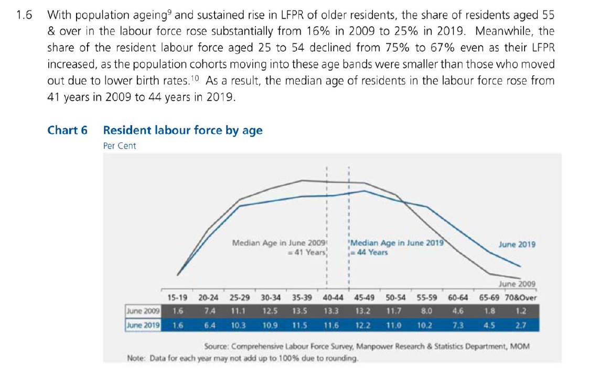
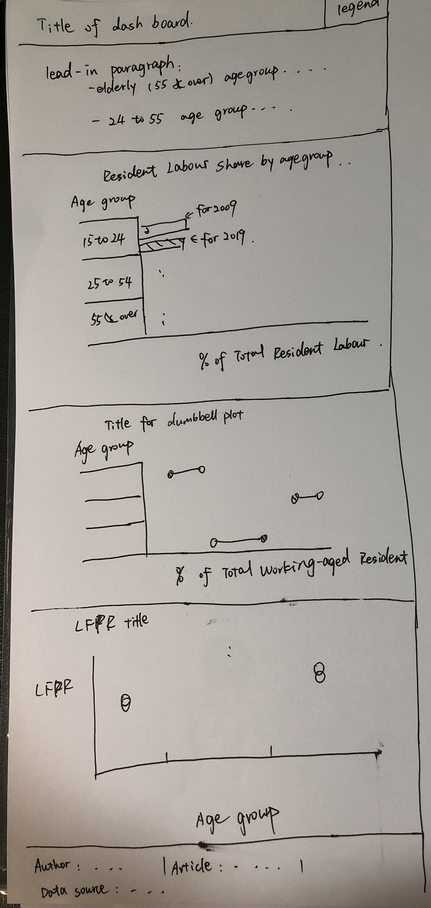
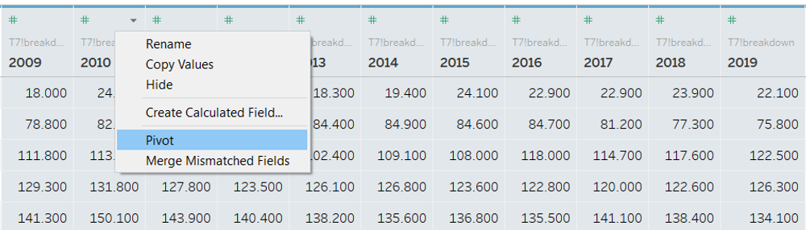
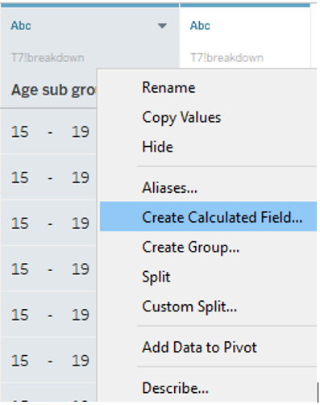
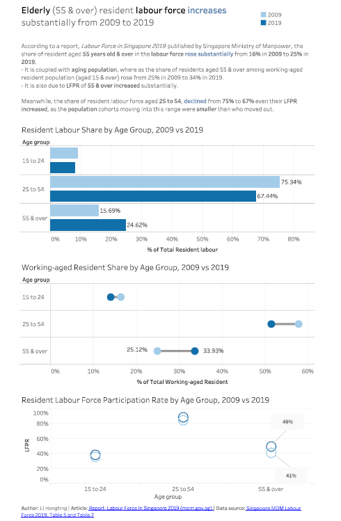

```{r setup, include=FALSE}
knitr::opts_chunk$set(echo = FALSE)
```

Data Visualisation (Tableau Online): [Singapore Resident Labour Force, 2009 vs 2019](https://public.tableau.com/profile/hongting.li8444#!/vizhome/DataViz1-SingaporeLabourForce2009vs2019/ResidentLabourForceDashboard)

Data Source: [Singapore MOM Labour Force 2019, Table 5 and Table 7](https://stats.mom.gov.sg/Pages/Labour-Force-Tables2019.aspx)


Original dataviz:

```{r original, echo=FALSE, fig.cap="Original dataviz", out.width = '100%'}


```

#  1 Critiques and Suggestions
###  1.1 Clarity

```{r}

SN <-c(1,2,3)
Critiques <-c("Contents from the paragraph e.g. 'share of residents aged 55 & over in the labour force rose substantially from 16% in 2009 to 25% in 2019', is not simply presented in the graph, but need to aggregate data mannually. ","The graph and table cannot support some information in the summary paragraph, e.g. aging population, LFPR. ", "The chart does not convey message on median age of residents in the labour force. ")
Suggestions <-c( "Re-organize age group as '15 to 24', '25 to 54' and '55 & over'. ", "Add chart on working-aged residents distribution and LFPR. ", "Exclude this part from summary, as age group is categorical data, and data source is already aggregated by age group.")

clarity <- data.frame(SN, Critiques, Suggestions)

#install.packages('knitr', 'dplyr', 'kableExtra')
library(knitr)
library(dplyr)
library(kableExtra)
kable(clarity,type='html',align='l',escape=F) %>%
  kable_styling() %>%
  row_spec(0, color = 'white', background = 'black', align='l') %>% #format header color and background. 
  column_spec(1, width_min="3em") %>%
  column_spec(2, width="25em") %>%
  row_spec(1:3, extra_css = "border-bottom: 1px solid")


```


### 1.2 Aesthetic

```{r}

SN <-c(4, 5,6)
Critiques <-c("Generally, clear use of fonts, font sizes and colors. Colors are consitantly used by year. "," Though median age is not well derived from same data source (as mentioned in SN/3), it is a good example to use annotation on the chart to highlight important information. ","Units are not indicated in y-axis, which makes the chart difficult to read. ")
Suggestions <-c("Follow and formart likewise.", "Follow this practice to mark/annotate important information on chart. ","Ensure proper axis use with title, headers, units and marks. ")
aesthetic <- data.frame(SN, Critiques, Suggestions)

library(knitr)
library(dplyr)
library(kableExtra)
kable(aesthetic,type='html',align='l') %>%
  kable_styling() %>%
  row_spec(0, color = 'white', background = 'black', align='l') %>% #format header color and background. 
  column_spec(1, width_min="3em") %>%
  column_spec(2, width="25em") %>%
  row_spec(1:3, extra_css = "border-bottom: 1px solid")
```


#  2 Sketch of Proposed Design

```{r proposal, echo=FALSE, fig.cap="Sketch of proposed design", out.width = '400', out.height='600'}


```

- Lead-in paragraph is to highlight key information and insights from visualizations, which helps to guide readers on the key points.Figures mentioned in these paragraph will also be annotated in charts. 
- Legend of year is explicitly displayed at top right corner, as this legend will be used throughout the dashboard. 
- To retain intent of original visualization and summary, a horizontal bar chart is used to compare Resident Labour Share by Age Group in 2009 versus what it was in 2019. This simplify the original chart with key information on resident labour force shares for 3 age groups. 
- To add a dumbbell chart to visualize the changes of Working-aged Resident Share by Age Group between 2009 and 2019. This is a variation of horizontal bar chart, where both years can be shown in same row, and easy to read the change in direction.
- To add a circle plot to show LFPR (Labour Force Participation Rate) by age groups, which is mentioned in original paragraph. 


#  3 Steps to Create Dataviz Using Tableau

### 3.1 Data preparation 

First, inspect data in excel, Table 7 includes resident labour force by 12 age sub-groups. Sheets, T7_F and T7_M are processed with following steps: (1) to remove excess rows at left and columns at right; (2) to add a new column 'Gender' followed by tab name.

```{r Dataprep1, echo=FALSE, fig.cap="Re-organized Table 7", out.width = '100%'}
knitr::include_graphics("Dataprep1.png")

```

Second, prepare Table 5 Working-aged labour force data likewise. Since we will study age group with wider age bands, it is not simply calculated with sub age group LFPR, but by dividing total of resident labour force by working-aged resident per age group. As such, we use Table 7, resident labour force devided by LFPR from Table 5 to capture working-aged resident.

```{r Dataprep2, echo=FALSE, fig.cap="Derive calculated table, working-aged resident population", out.width = '100%'}
knitr::include_graphics("Dataprep2.png")

```

Third, import T7 data to Tableau Desktop by choosing File on the navigation bar and then connect to a Microsoft Excel file as below graph. 


```{r importdata, echo=FALSE, fig.cap="Import data from excel file", out.width = '200'}
knitr::include_graphics("Import data.png")

```

```{r importdata2, echo=FALSE, fig.cap="Dragging over processed sheet to working area", out.width = '400'}
knitr::include_graphics("Import data2.png")

```


Forth, Pivot 11 years as Year column, change Pivot Field Name as "Year", and Pivot Field Measure as "Resident labour". Change "Year" column data type to "Date" by clicking the small "abc" symbol at top left of a column. 

```{r pivot1, echo=FALSE, fig.cap="Pivot data from columns to rows", out.width = '100%'}


```

```{r changedatatype, echo=FALSE, fig.cap="Change data type", out.width = '400'}
knitr::include_graphics("Change data type.png")

```

Last, create a calculated field named "Age group" by right clicking column "Age sub group", choose "Create a calculated field" with below formula. 

```{r calculatedfield1, echo=FALSE, fig.cap="Create a calculated field 1", out.width = '400'}


```
```{r calculatedfield2, echo=FALSE, fig.cap="Create a calculated field 2", out.width = '600'}
knitr::include_graphics("CalculatedField2.png")

```

Repeat import and pivot likewise for the calculated table, "Resident population" sheet and join by "Year" with "T7_breakdown". After pivoting 11 years, comprehend join selection by "Gender" and "Age sub group". 

```{r importdata3, echo=FALSE, fig.cap="Join two sheets", out.width = '600'}
knitr::include_graphics("Import data3.png")

```

### 3.2 Visualization 1: Resident Labour Share by Age Group, 2009 vs 2019

Create a new sheet named as "% of Total Resident Labour by age group". 
Select and drag "Age group", "Year" columns to Rows, "Resident labour" to columns. Right click column attribute, select "Quick Table Calculation" by "Percent of Total", and "Computing" with "Age group". 

```{r 32adddata, echo=FALSE, fig.cap="Add attributes and measures to chart and change calculation type", out.width = '100%'}
knitr::include_graphics("3.2add data.png")

```

Then, add "Year" to filter, select "Years" in the first pop out window and choose 2009, 2019 only as we want to compare this two timestamp. 

```{r 32filter, echo=FALSE, fig.cap="Add year to filter", out.width = '100%'}
knitr::include_graphics("3.2filter.png")

```

Then, "Year" is moved over to Color under Marks pane and select "blue" for 2019 and "light blue" for 2009.

```{r 32color, echo=FALSE, fig.cap="Add year to color", out.width = '100%'}
knitr::include_graphics("3.2color.png")

```

As mentioned in section 2, figures appeared in lead-in paragraph are marked/annotated in chart. It is achieved by right click particular chart dataviz object, e.g. bar chart and select "Mark Label" and then "Always Show" to add labels selectively. 

```{r 32mark, echo=FALSE, fig.cap="Add mark labels to the chart", out.width = '100%'}
knitr::include_graphics("3.2mark.png")

```

Last, hide "Year" from column labels as it is colored with legend, and edit sheet title as "Resident Labour Share by Age Group, 2009 vs 2019", and tooltip as:

> \<Age group> age group includes <% of Total SUM(Resident labour)> of total resident labours in <YEAR(Year)>.


### 3.3 Visualization 2: Working-aged Resident Share by Age Group, 2009 vs 2019

Create a new sheet for working-aged resident share by age group. 
Select and drag "Age group" to Rows, "Resident" twice to columns as we want to create both the dot and line.

Then, add "Year" to filter, select "Years" in the first pop out window and choose 2009, 2019 only as we want to compare this two timestamp. 

Then, "Year" is moved over to Color under Marks pane for first "Resident" column and choose object shape as "Circle". 

Under Marks pane for second "Resident" column, choose object shape as "Line", drag over "Year" to "Path" and select path type as "Jump". 

```{r 33objectshape, echo=FALSE, fig.cap="Change resident population as line chart", out.width = 300}
knitr::include_graphics("3.3objectshape.png")

```

Right click right side Resident chart axis and select "Dual Axis". Then, hide axis at the top by right clicking x-axis at top and uncheck "Show header".  

```{r 33dualaxis, echo=FALSE, fig.cap="Use dual axis", out.width = '100%'}
knitr::include_graphics("3.3dualaxis.png")

```

Swap sequence of two column to make the circle to appear behind the lines. Change both columns "Quick Table Calculation" type as "Percent of Total", and "Computing" with "Age group". 

Last, add marks for age group "55 & over", edit x-axis as "% of Total Working-aged Resident", sheet title as "Resident Labour Share by Age Group, 2009 vs 2019" and tooltip as:

> \<Age group> age group includes <% of Total SUM(Resident)> of total working-age residents in <YEAR(Year)>.

### 3.4 Visualization 3: Resident LFPR by Age Group, 2009 vs 2019

Create a new sheet named as "Labour Force Participation Rate" by age group. 
Create a calculated field, named "LFPR" with below formula:

> {EXCLUDE [Gender]: sum([Resident labour])/sum([Resident])}

Select and drag "LFPR" to Rows, "Age group" to columns, "Year" to both Color and Filters, with 2009 and 2019 selected.

Change Shape as "Shape" with empty circles, which help reader to visualize the change by colors easily. 

Next, edit title with dynamic information:

> Resident <Sheet Name> by Age Group, 2009 vs 2019

Also, change tooltip as:

> LFPR for residents aged <Age group> is <SUM(LFPR)> in <YEAR(Year 1)>. 

Last, we want to highlight LFPR for age group "55 & over", but mark label not appearing as percentage, so annotation is used instead by right clicking the object and select "Annotate" and then "Mark". 

```{r 34annotate, echo=FALSE, fig.cap="Label particular element with annotation", out.width = '400'}
knitr::include_graphics("3.4annotate.png")

```

with below content:

> <SUM(Labour force participation rate)>

### 3.5 Dashboard creation

Firstly, create a dashboard and drag above 3 visualizations over. 

Secondly, under the Dashboard Pane, select and drag a text object to the top of the dashboard as title.In the pop out window, use font size, bold and color to highlight key information. 

```{r 35text, echo=FALSE, fig.cap="Add text object to dashboard", out.width = '300'}
knitr::include_graphics("3.5text.png")

```

Next, similar to 2nd step, add another box as description paragraphs to discuss insights.In the pop out window, Use font size, bold and color to highlight key information. 

Moreover, from Dashboard pane, under Object, select and drag "Blank" over to the top right corner, to index the legend a bit lower than the title. 

```{r 35blank, echo=FALSE, fig.cap="Add blank object to dashboard", out.width = '300'}
knitr::include_graphics("3.5blank.png")

```

Next, x axis title,"Age group" is shown at top of the chart in visualization 3, because it is categorical data, and axis header is at top of the chart, which is not conventional to position axis element/unit and header separately. (This is a limitation with Tableau currently.) So, we hide this by right clicking the title area and selecting field label for columns. This axis header is re-positioned at bottom of the chart by adding a floating text object. Select "Floating" at the bottom of Objects pane, then drag "Text" object over to the dashboard to create a floating text object. 

```{r 35floatingtext, echo=FALSE, fig.cap="Add floating text object to dashboard", out.width = '300'}
knitr::include_graphics("3.5floatingtext.png")

```

Lastly, add a text object at the bottom and include author, article and data source information. Hyperlink is pre-generated and pasted in excel and pasted over. 

#  4 Final Visualization

Below is the final visualization after this makeover journey. 

```{r dashboard, echo=FALSE, fig.cap="Final visualization", out.width = '100%'}


```


#  5 Discussion

### 5.1 Insight 1: Elderly resident labour force share increase

Looking at the horizontal bar chart, we see that there are substantial increase from 16% in 2009 to 25% in 2019 for share of resident labour force aged 55 years old and above. While, for other 2 age groups, the share decreased from 2009 to 2019.  

This dashboard highlighted that the share of resident aged 55 years old & over in the labour force rose substantially from 16% in 2009 to 25% in 2019. Meanwhile, the share of resident labour force aged 25 to 54, declined from 75% to 67%.

### 5.2 Insight 2: Shifting to aging population 
From the dumbbell plot, we can see there is a aging population trend, whereas the share of residents aged 55 & over among working-aged resident population (aged 15 & over) rose from 25% in 2009 to 34% in 2019. 

### 5.3 Insight 3: LFPR increase across age groups
From the circle chart, we can observe that LFPR increase across 3 age groups, with 55 years old and over being the most substantial one. 

Even though LFPR increase for the 15 to 24, and 25 to 54 age groups, the population cohorts moving into these age bands are smaller than those moving out as discussed in 5.2. As a result, resident labour force share descreased for the 2 age groups as mentioned in 5.1. 

### 5.4 Future works
We can also notice dataset include gender information, we might include this attribute to assess if there is any resident labour force population trend related to gender for future works.

#  6 References
- [How to make dumbbell charts in Tableau](https://www.tableau.com/about/blog/2016/10/how-make-dumbbell-charts-tableau-60319)