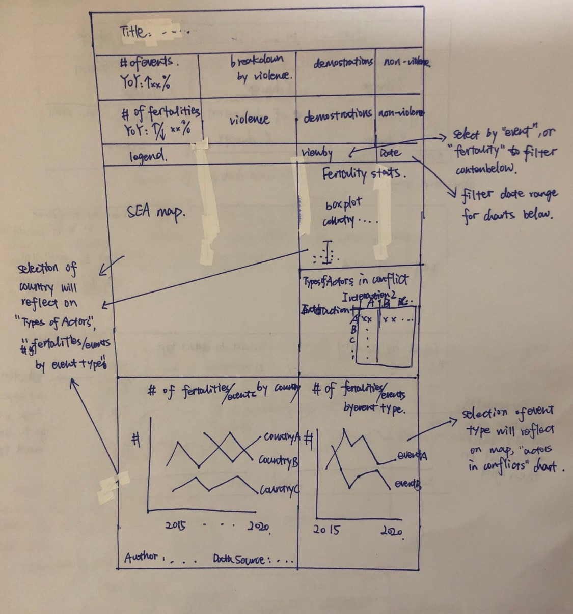
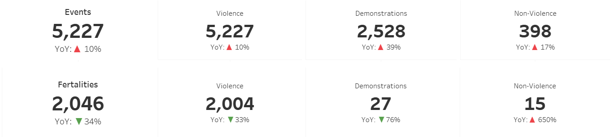

```{r setup, include=FALSE}
knitr::opts_chunk$set(echo = FALSE)
```

Data Visualisation (Tableau Online): [SEA Armed Conflicts](https://public.tableau.com/profile/lihongting#!/vizhome/SEAArmedconflicts/Summary)

Data Source: [The Armed Conflict Location & Event Data Project (ACLED), South East Asia, 2015 to 2020](https://acleddata.com/#/dashboard)


#  1 Critiques and Suggestions

The original data visualization intended to reveal the spatio-temporal patterns of armed conflict in selected South-east Asia countries between 2015-2020.

```{r 1, echo=FALSE, fig.cap="Critic original DataVi", out.width = '100%'}
knitr::include_graphics("1.png")

```

###  1.1 Clarity

```{r}
SN <-c(1,2)
Critiques <-c(
  "Axis for Armed Conflict Event by Type has different scale, it is intuitively misleading when comparing across. ",
  "Event Type color legend is not used on the Armed Conflict Event by Type, which makes reader confused about the purpose.")

Suggestions <-c(
  "Propose to use a single line chart so axis scale is aligned. ",
  "Suggest aligning on the usage of color across different charts. ")

clarity <- data.frame(SN, Critiques, Suggestions)

#install.packages('knitr', 'dplyr', 'kableExtra')
library(knitr)
library(dplyr)
library(kableExtra)
kable(clarity,type='html',align='l',escape=F) %>%
  kable_styling() %>%
  row_spec(0, color = 'white', background = 'black', align='l') %>% #format header color and background. 
  column_spec(1, width_min="3em") %>%
  column_spec(2, width="25em") %>%
  row_spec(1:2, extra_css = "border-bottom: 1px solid")
```


### 1.2 Aesthetic

```{r}

SN <-c(3,4)
Critiques <-c("When all countries are selected on the map, the boarder of countries is hard to tell. ", 
  "Count of Sheet1 does not have meaning and is redundant. ")

Suggestions <-c("Add one color layer for countries. ",
  "Remove it. ")

aesthetic <- data.frame(SN, Critiques, Suggestions)

kable(aesthetic,type='html',align='l') %>%
  kable_styling() %>%
  row_spec(0, color = 'white', background = 'black', align='l') %>% #format header color and background. 
  column_spec(1, width_min="3em") %>%
  column_spec(2, width="25em") %>%
  row_spec(1:2, extra_css = "border-bottom: 1px solid")
```


### 1.3 Interactivity

```{r}

SN <-c(5,6)
Critiques <-c("Selection of country does not reflect on the line chart, which does not give reader information about armed conflict event by type at country level. ",
  "Selection of event conflict does not reflect on the line chart. ")

Suggestions <-c("Apply filter to multiple sheets. ", 
"Add “Action” to apply filter for same charts. ")

Interactivity <- data.frame(SN, Critiques, Suggestions)

library(knitr)
library(dplyr)
library(kableExtra)
kable(aesthetic,type='html',align='l') %>%
  kable_styling() %>%
  row_spec(0, color = 'white', background = 'black', align='l') %>% #format header color and background. 
  column_spec(1, width_min="3em") %>%
  column_spec(2, width="25em") %>%
  row_spec(1:2, extra_css = "border-bottom: 1px solid")
```

#  2 Sketch of Proposed Design

```{r 2, echo=FALSE, fig.cap="Sketch of proposed design", out.width = '400', out.height='100%'}


```

On top of proposed solution to workaround critiques, we noticed some events are non-violence events with low fertility, one way to measure severity is by fertility, hence proposed to add key risk indicators, event and fertility counts for current year and Year over Year (YoY) percentage and breakdown by Event Group. 
Besides, propose to add a boxplot to illustration the distribution of fertility distribution by country.  
Last, add actors in conflict to see the most common and deadly parties in armed conflict events. 


#  3 Steps to Create Dataviz Using Tableau

### 3.1 Import data

The data source provided includes data from 2010 to 2020, while the original DataViz only includes 2015 to 2020, hence we removed 2010 to 2014 data from excel using column “Year”. 
Then, create one Tableau file and import data by clicking “Connect to Data” under Data pane and “Microsoft Excel” under To a File. 

```{r 3, echo=FALSE, fig.cap="Import data", out.width = '100%'}
knitr::include_graphics("3.png")

``` 
 
 
### 3.2 Reset Data Type and Edit Alias
Next, change “Year” from “Number (whole)” to “Date” by clicking the “#” symbol. 

```{r 4, echo=FALSE, fig.cap="Change data type", out.width = '100%'}
knitr::include_graphics("4.png")

``` 

Besides, change field “Interaction” to be “String” and split into two columns by right click the column and “Create Calculated Fields”, where for “int1” is the smaller actor type code in a conflict, and int2 is the larger actor type code in a conflict, when there is no 2nd type of actor, 0 is used. Formulas for “int1” and “int2” as below. 
 
```{r 5, echo=FALSE, fig.cap="Create calculated field for actor type 1", out.width = '100%'}
knitr::include_graphics("5.png")

``` 

```{r 6, echo=FALSE, fig.cap="Create calculated field for actor type 2", out.width = '100%'}
knitr::include_graphics("6.png")

``` 

```{r 7, echo=FALSE, fig.cap="Create calculated field for actor type 3", out.width = '100%'}
knitr::include_graphics("7.png")

``` 

Then right click “Int1” column to edit “Aliases…” with below changes. 
 
```{r 8, echo=FALSE, fig.cap="Edit alias for actor type 1", out.width = '100%'}
knitr::include_graphics("8.png")

``` 
 
```{r 9, echo=FALSE, fig.cap="Edit alias for actor type 2", out.width = '100%'}
knitr::include_graphics("9.png")

``` 

### 3.3 Key risk indicators
To highlight key risk indicators of current year and YoY changes, we introduced to measure number of “Events” and “Fertalities”. 

#### 3.3.1 Create calculated fields
Calculated fields are created by clicking small triangle under Data pane. 

```{r 10, echo=FALSE, fig.cap="Create calculated field", out.width = '100%'}
knitr::include_graphics("10.png")

``` 

To monitor current year number of events, firstly, we need to create calculated fields to filter date.

```{r 11, echo=FALSE, fig.cap="Create calculated field, Recent Year", out.width = '100%'}
knitr::include_graphics("11.png")

``` 

To compare with same duration in previous year, below field is created. 

```{r 12, echo=FALSE, fig.cap="Create calculated field, Last Year Partial", out.width = '100%'}
knitr::include_graphics("12.png")

``` 

Then, “Event|RY” is created to count number of events in recent year, and “Event | LYP” for same period last year.

```{r 13, echo=FALSE, fig.cap="Create calculated field, Event | RY", out.width = '100%'}
knitr::include_graphics("13.png")

``` 

```{r 14, echo=FALSE, fig.cap="Create calculated field, Event | LYP", out.width = '100%'}
knitr::include_graphics("14.png")

``` 

Then, YoY change percentage can be calculated. 

```{r 15, echo=FALSE, fig.cap="Create calculated field, Event | % YOY", out.width = '100%'}
knitr::include_graphics("15.png")

``` 

Lastly, below is created to represent positive or negative symbols. 

```{r 16, echo=FALSE, fig.cap="Create calculated field, Event | % YOY | Down", out.width = '100%'}
knitr::include_graphics("16.png")

``` 

```{r 17, echo=FALSE, fig.cap="Create calculated field, Event | % YOY | Up", out.width = '100%'}
knitr::include_graphics("17.png")

``` 

Create “MIN(0.0)” to locate KPI at centre of field. 

```{r 18, echo=FALSE, fig.cap="Create calculated field, MIN(0.0)", out.width = '100%'}
knitr::include_graphics("18.png")

``` 

Also, group “Event Type” to “Event Group” by calculated field as below, based on ACLED_Codebook_2019FINAL. 

```{r 19, echo=FALSE, fig.cap="Create calculated field, Event Group", out.width = '100%'}
knitr::include_graphics("19.png")

``` 

#### 3.3.2 Create KRI

Create a sheet by clicking the icon with vertical line on the bottom tab bar. 

```{r 20, echo=FALSE, fig.cap="Create a new sheet", out.width = '100%'}
knitr::include_graphics("20.png")

``` 

Double click the newly created tab to named as “Event total”, select and drag “Event Date” to Tooltip, “Event | RY”, “Event | % YOY”, “Event | % YOY | Up”, “Event | % YOY | Down” to Text. 

```{r 21, echo=FALSE, fig.cap="Create sheet for number of events", out.width = '100%'}
knitr::include_graphics("21.png")

``` 

Then click “Text” and then “…” button to format text to be displayed. 

```{r 22, echo=FALSE, fig.cap="Edit number of events tab", out.width = '100%'}
knitr::include_graphics("22.png")

``` 

Set “Events” as size, 11 and font, Tableau Book and bolded. “<SUM(Event | RY)>” as size-26, font-Tableau Bold. Also highlight YoY increase in red and decrease in green. 

```{r 23, echo=FALSE, fig.cap="Edit label", out.width = '100%'}
knitr::include_graphics("23.png")

``` 

Also remove zero-line and grid lines by selecting “Format” on the toolbar and “Lines”. Click arrows for “Grid Lines”, “Zero Lines” and “Axis Rulers” and set as “None”. 

```{r 24, echo=FALSE, fig.cap="Edit line 1", out.width = '100%'}
knitr::include_graphics("24.png")

``` 

```{r 25, echo=FALSE, fig.cap="Edit line 2", out.width = '100%'}
knitr::include_graphics("25.png")

``` 

Click Tooltip under “Marks” pane to enter below text, so when hover around the chart, below will be presented. 
  
```{r 26, echo=FALSE, fig.cap="Edit Tooltip", out.width = '100%'}
knitr::include_graphics("26.png")

``` 

Duplicate this sheet by right click tab “Event Total” and choose “Duplicate”. 

```{r 27, echo=FALSE, fig.cap="Duplicate sheet", out.width = '100%'}
knitr::include_graphics("27.png")

``` 
 
Double click to rename as “Violent Event” and add “Event Group” as filter with “Violent events” selected. 

```{r 28, echo=FALSE, fig.cap="Add Filter 1", out.width = '100%'}
knitr::include_graphics("28.png")

``` 

```{r 29, echo=FALSE, fig.cap="Add Filter 2", out.width = '100%'}
knitr::include_graphics("29.png")

``` 

### 3.4 Map
#### 3.4.1 Create parameters and calculated fields

To enable map to be viewed by either event or fertility, add Parameter “View by” by clicking the triangle under “Data” pane and choose “Create Parameter…”, select Data type as “String” with “List” of values, “Event” and “Fertality”. 

```{r 30, echo=FALSE, fig.cap="Create parameter 1", out.width = '100%'}
knitr::include_graphics("30.png")

```  
 
```{r 31, echo=FALSE, fig.cap="Create parameter 2", out.width = '100%'}
knitr::include_graphics("31.png")

```  

Then create calculated field “View by” to select field when “View by” parameter is selected. 

```{r 32, echo=FALSE, fig.cap="Create calculated field, View by", out.width = '100%'}
knitr::include_graphics("32.png")

```  

#### 3.4.2 Add map

Add “Country” and “Year” to Filters, “Country” and “Event Id Cnty” to “Detail”, “Event Group” to Colour, “AVG(Longitude)” as Column and “AVG(Latitude)” as Row. 

```{r 33, echo=FALSE, fig.cap="Create map", out.width = '100%'}
knitr::include_graphics("33.png")

```  
 
Now we can see armed conflicts in South East Asia, but the boarder between countries is not clear, hence we add “AVG(Latitude)” again to Rows, and select “Country” as color, and synchronise them on same graph by choosing element type under “Marks” pane as “Map”, and right clicking second “AVG(Latitude)” and set as “Dual Axis”. 

```{r 34, echo=FALSE, fig.cap="Add country layer in map", out.width = '100%'}
knitr::include_graphics("34.png")

```  

```{r 35, echo=FALSE, fig.cap="Apply dual axis in map", out.width = '100%'}
knitr::include_graphics("35.png")

```  
 
By doing so, the circles for individual events are hidden under the country layer, so bring it up by bringing second “AVG(Latitude)” to the font on the Rows.

Under “Marks” pane, click “Color” to “Edit Colors” and select Color Palette to choose desired one, e.g. “Blue-Teal” for map layer, click “Assign Palette” and “OK” to complete. 

```{r 36, echo=FALSE, fig.cap="Edit color", out.width = '100%'}
knitr::include_graphics("36.png")

```  
 
Then select first “AVG(Latitude)” and update Tooltip as below. 

```{r 37, echo=FALSE, fig.cap="Update Tooltip", out.width = '100%'}
knitr::include_graphics("37.png")

```  

### 3.5	Boxplot for fertility count in an event
#### 3.5.1	Create parameters and calculated fields

Create Parameter “Jitter param” as below and calculated field “Jitter” to add jitter to box plot. 

```{r 39, echo=FALSE, fig.cap="Create parameter, Jitter param", out.width = '100%'}
knitr::include_graphics("39.png")

``` 

```{r 38, echo=FALSE, fig.cap="Create calculated field, Jitter", out.width = '100%'}
knitr::include_graphics("38.png")

``` 
 
#### 3.5.2	Create boxplot with jitters

Adding “Country”, “Jitter” to Columns, “Fertilities” to Rows, and “Event Group” to Color. Select “boxplot” under “Show Me”. 

For color, reduce Opacity to “25%” to show the density of fertilities in one event.

Right click x-axis to remove jitters, and name chart title as “Fertalities Statistics by Country”
 
```{r 40, echo=FALSE, fig.cap="Create boxplot", out.width = '100%'}
knitr::include_graphics("40.png")

``` 

```{r 41, echo=FALSE, fig.cap="Edit Opacity for jitters", out.width = '100%'}
knitr::include_graphics("41.png")

``` 
 
Right click y-axis to set axis to start with “0”, “Logarithmic” scale and name as “Fertalities”. 

```{r 42, echo=FALSE, fig.cap="Edit y-axis", out.width = '100%'}
knitr::include_graphics("42.png")

``` 
 
Right click boxplot to “Edit” and set “Whiskers extend to” as “Maximum extent of the data”. 

```{r 43, echo=FALSE, fig.cap="Edit boxplot", out.width = '100%'}
knitr::include_graphics("43.png")

``` 
 
 
Add “Event Date” to Tooltip and update it as below.
 
```{r 44, echo=FALSE, fig.cap="Edit tooltip for boxplot", out.width = '100%'}
knitr::include_graphics("44.png")

``` 

### 3.6	Association table for actors in conflicts
#### 3.6.1	Create association table

Add “Int2” to Columns, “Int1” to Rows, “Country” to Tooltip, “View by” to Text, select “text tables” under Show Me.

Rename title as “Actors in Conflicts”, Tooltip as “<Int1> vs <Int2> in <ATTR(Country)>: <SUM(View by)>”. 

```{r 45, echo=FALSE, fig.cap="Create association table for actor types in conflicts", out.width = '100%'}
knitr::include_graphics("45.png")

``` 
 
### 3.7	Line chart for breakdown by country, event type
#### 3.7.1	Create calculated field

Create calculated field, “View by text”, to rephrase “View by” parameter selection. 

```{r 46, echo=FALSE, fig.cap="Create calculated field, View by text", out.width = '100%'}
knitr::include_graphics("46.png")

``` 
 
#### 3.7.2	Create line chart for breakdown by country

Select “Year” as Columns, “View by” as Rows, “Country” as Color. 

Update chart title as “Yearly Number of <Parameters.View by> by Country”, Tooltip as “<SUM(View by)> armed conflict <ATTR(View by text)> in <Country> in <YEAR(Year)>.”.

Right click x-axis and de-select “Show Header”. 

```{r 47, echo=FALSE, fig.cap="Hide header for x-axis", out.width = '100%'}
knitr::include_graphics("47.png")

``` 

```{r 48, echo=FALSE, fig.cap="Edit y-axis 1", out.width = '100%'}
knitr::include_graphics("48.png")

``` 

```{r 49, echo=FALSE, fig.cap="Edit y-axis 2", out.width = '100%'}
knitr::include_graphics("49.png")

``` 

```{r 50, echo=FALSE, fig.cap="Edit y-axis 3", out.width = '100%'}
knitr::include_graphics("50.png")

``` 

Edit tooltip for line chart as below content. 

```{r 51, echo=FALSE, fig.cap="Edit Tooltip for line chart", out.width = '100%'}
knitr::include_graphics("51.png")

``` 

#### 3.7.3	Create line chart for breakdown by event type
Similarly, create line chart with breakdown by event type like Section 3.7.2, by choosing “Event Type” to as colour differentiation.


### 3.8	Dashboard
#### 3.8.1	Create dashboard

Create a dashboard by click the icon with table grid on the bottom tab bar. 

```{r 52, echo=FALSE, fig.cap="Create dashboard", out.width = '100%'}
knitr::include_graphics("52.png")

``` 
 
Enter Custom size with 1366px width X 1600px height by clicking triangles.

```{r 53, echo=FALSE, fig.cap="Edit dashboard size", out.width = '100%'}
knitr::include_graphics("53.png")

``` 

#### 3.8.2	Add Text objects and Sheets to dashboard
Select “Text” Object and move over to dashboard, to create title, footnote and etc.. 
```{r 54, echo=FALSE, fig.cap="Add text object", out.width = '100%'}
knitr::include_graphics("54.png")

```  

```{r 55, echo=FALSE, fig.cap="Create dashboard title", out.width = '100%'}
knitr::include_graphics("55.png")

```  
 
Then on the Sheets pane, move over relevant sheets to planned location, remove map sheet title as it is self-explained. Remove redundant filters. 

#### 3.8.3	Create Actions for interactivity

Select one sheet object in dashboard and click “Worksheet” on toolbar and choose “Actions…” to create actions. On the top up window, select “Add Action” and “Filter…”. 

```{r 56, echo=FALSE, fig.cap="Select sheet and add action 1", out.width = '100%'}
knitr::include_graphics("56.png")

```  

```{r 57, echo=FALSE, fig.cap="Add action 2", out.width = '100%'}
knitr::include_graphics("57.png")

```  

Then another window pops up, for example, to add filter by country, first choose the source sheet with “Select” action and target sheet by clearing the selection will “Show all values”, click “Add Filter…” to add “Country” as filter for both source and target sheets.

Similarly add “event type” as filter action. 
 
```{r 58, echo=FALSE, fig.cap="Add action 3", out.width = '100%'}
knitr::include_graphics("58.png")

```  
 
#### 3.8.4	Final dashboard 

Below shows final dashboard design. 
 
```{r 59, echo=FALSE, fig.cap="Dashboard design", out.width = '100%'}
knitr::include_graphics("59.png")

```  

## 4.	Insights

### 4.1 YoY events increased, and fertilities decreased 

Number of events increase 10% YoY across three event groups, and fertalities decreased 34%, even though fertalities due to non-violent events increased 650%. 

```{r 60, echo=FALSE, fig.cap="KRI", out.width = '100%'}


```  
 
### 4.2 Violent conflicts and Demonstrations are most common event group


When View by Event is selected, we can see that violent events and demonstrations has high density. 

```{r 61, echo=FALSE, fig.cap="SEA map by event", out.width = '100%'}
knitr::include_graphics("61.png")

```   

When View by Fertality is selected, we can see Philippines is where most fertilities happen due to violent armed conflicts. 
 
```{r 62, echo=FALSE, fig.cap="SEA map by fertalities", out.width = '100%'}
knitr::include_graphics("62.png")

```   

### 4.3 Most severe conflict happened in Myanmar with 243 death

From boxplot below, we can see that one violent event happened on 28 August 2017 in Myanmar caused most death, 243. 

```{r 63, echo=FALSE, fig.cap="Fertalities by ", out.width = '100%'}
knitr::include_graphics("63.png")

```    

### 4.4 State Force, Political Militias and Rebel Group are involved in most conflicts 

From Actors in Conflicts table, noticed that Political Militias, State Forces, Rebel Groups cause the most fertalities. 

```{r 64, echo=FALSE, fig.cap="Actor type in conflicts table", out.width = '100%'}
knitr::include_graphics("64.png")

```    
  
### 4.5	Violence again civilians and protests are most common event type

From Yearly Number of Event by Event Type, we notice that Violence against civilians and protests are most common event type.
 
```{r 65, echo=FALSE, fig.cap="Violence against civilians, protests are most common conflict types", out.width = '100%'}
knitr::include_graphics("65.png")

```    

From fertality version, it is observed that Violence against civilians and battles cause most fertility.
 
```{r 66, echo=FALSE, fig.cap="Violence against civilians, battles are most deadly conflict types", out.width = '100%'}
knitr::include_graphics("66.png")

```  
